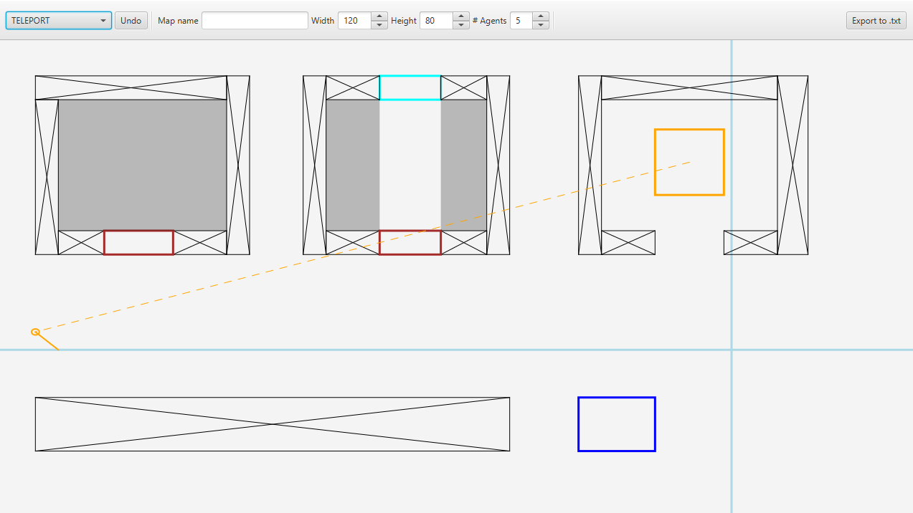

# Multi-Agent Surveillance Map Editor

Simple map editor developed by Group 3 for Project 2-2 at DKE, Maastricht University.

## Running
Simply clone the repository to your device and run the project with Gradle in your IDE.

## Usage
### Editing
Click and hold on the screen to draw a rectangle of the selected object type. The light blue reticle indicates where your cursor is in the map's discrete space.

Placing map objects can be undone with the "Undo" button or by using CTRL + Z (doesn't work if the map width/height/name fields are selected).

### Exporting
The export button at the top right of the screen exports the current map to the `/output/` folder of the project directory. If no map name is given, the generated map is simply named `map.txt`

    </img>

